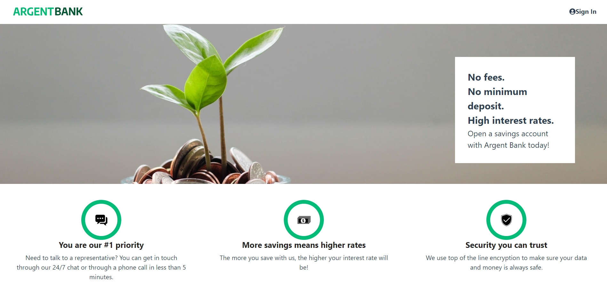

# Argent Bank - Créez une application bancaire

HTML / CSS / REACT / REDUX / MONGODB

@Openclassrooms

## Les objectifs

* Implémenter un gestionnaire d'état dans une application React
* Intéragir avec une API
* Modéliser une API
* S'authentifier à une API

### 1. Informations générales

Dans cette documentation nous verrons comment lancer le projet sur votre machine.

## 2. Projet

### 2.1 Prérequis
* [NodeJS](https://nodejs.org/en/)

### 2.2 Lancement du projet

### 2.2.1 Backend

* Fork ce [repo](https://github.com/OpenClassrooms-Student-Center/Project-10-Bank-API#readme) et suivez les instructions

### 2.2.2 Frontend

* Fork ce repo
* Cloner le sur votre machine
* Saisisser la commande `npm install` qui va installer toutes les dépendances 
* Saisisser la commande `npm run start` qui vous permettra d'exécuter la partie frontend du projet sur le port 3000
